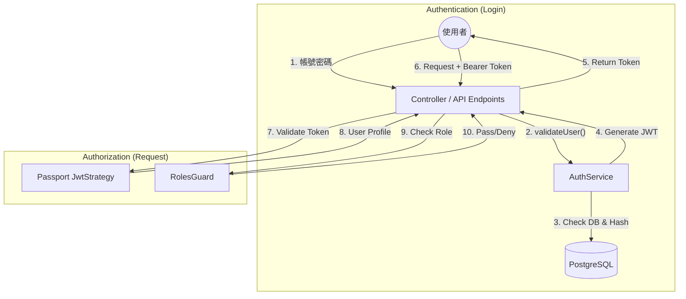
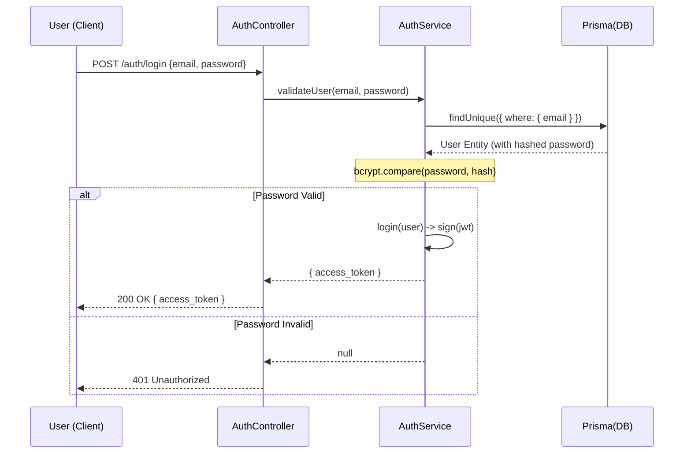
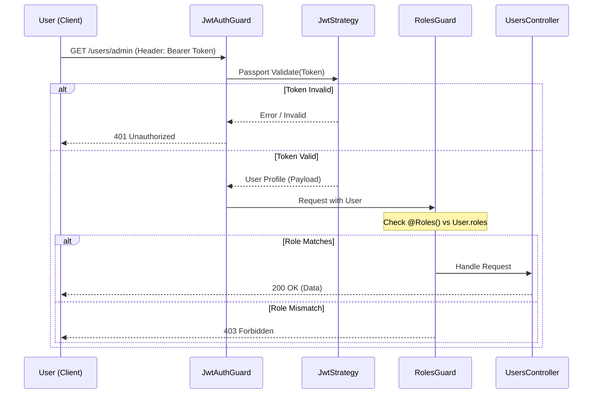

# System Architecture Document

## 1. 系統概述 (System Overview)
本專案為基於 **NestJS** 框架的後端 REST API 系統，採用 **領域驅動設計 (Domain-Driven Design, DDD)** 架構原則，並結合 **PostgreSQL** 資料庫與 **Prisma ORM** 進行資料管理。

主要技術堆疊：
- **Framework**: NestJS (Modular Architecture)
- **Database**: PostgreSQL (via Docker/Colima)
- **ORM**: Prisma (Migration & Client)
- **Authentication**: JWT (JSON Web Token) + Passport
- **Authorization**: RBAC (Role-Based Access Control)

---

## 2. 目錄結構說明 (Directory Structure)
本專案採用 **Modular DDD (模組化 DDD)** 結構，每個主要業務領域 (如 Users, Auth) 都是一個獨立的 Module，內部再細分層級。

```
src/
├── app.module.ts            # 應用程式根模組 (Root Module)
├── main.ts                  # 應用程式進入點 (Entry Point)
├── prisma.service.ts        # Prisma 資料庫連線服務 (Global)
├── prisma.module.ts         # Prisma 模組
│
├── common/                  # 共用核心層 (Shared Kernel)
│   ├── decorators/          # 自定義裝飾器 (如 @Roles)
│   ├── guards/              # 自定義守衛 (如 RolesGuard)
│   └── filters/             # (預留) 異常過濾器
│
├── auth/                    # 身份驗證模組 (Authentication Context)
│   ├── domain/              # Auth 相關實體或型別
│   ├── application/         # 應用層服務 (如 AuthService: 處理登入/註冊邏輯)
│   ├── infrastructure/      # 基礎設施層 (如 AuthController, JwtStrategy)
│   └── auth.module.ts       # Auth 模組定義
│
└── users/                   # 使用者模組 (User Context)
    ├── domain/              # [核心] 領域層
    │   └── user.entity.ts   # User 實體定義 (純 TypeScript 類別)
    ├── application/         # [協調] 應用層
    │   └── (預留) UseCases 或 DTOs
    ├── infrastructure/      # [實作] 基礎設施層
    │   └── users.controller.ts # 處理 HTTP 請求，呼叫 Application 層或直接存取 Prisma
    └── users.module.ts      # Users 模組定義
```

---

## 3. 架構分層說明 (Layered Architecture)

### Domain Layer (領域層)
- **位置**: `src/<module>/domain/`
- **職責**: 定義業務的核心物件 (Entities) 與規則。此層應盡量保持「純淨」，不依賴外部框架或資料庫細節。
- **範例**: `User` class (定義使用者的屬性與基本行為)。

### Application Layer (應用層)
- **位置**: `src/<module>/application/`
- **職責**: 負責使用案例 (Use Cases) 的流程協調。它會呼叫 Domain 層的邏輯，或呼叫 Infrastructure 層的儲存庫來完成任務。
- **範例**: `AuthService` (協調 Prisma 查使用者 -> 密碼比對 -> 簽發 Token)。

### Infrastructure Layer (基礎設施層)
- **位置**: `src/<module>/infrastructure/`
- **職責**: 處理針對外部世界的介面。包含 HTTP 控制器 (Controllers)、資料庫實作 (Repositories)、第三方 API 連接等。
- **範例**: `UsersController` (接收 HTTP GET 請求 -> 回傳 JSON 資料)。

---

## 4. 身份驗證與授權 (Auth & Security)

### Authentication (驗證 - "你是誰")
- **機制**: 使用 **JWT (JSON Web Token)**。
- **流程**:
    1. 使用者呼叫 `POST /auth/login` 提供 Email/密碼。
    2. `AuthService` 驗證成功後，回傳一組 `access_token`。
    3. 設定 `JwtStrategy`：後續請求需在 Header 帶入 `Authorization: Bearer <token>`。
    4. 系統透過 `JwtAuthGuard` 驗證 Token 合法性，並解析出 User 資訊放入 `req.user`。

### Authorization (授權 - "你能做什麼")
- **機制**: **RBAC (Role-Based Access Control)**。
- **角色**: 定義於 Prisma Schema 的 Enum (`USER`, `ADMIN`, `MANAGER`)。
- **實作**:
    - **`@Roles(Role.ADMIN)`**: 標記在 Controller 上，宣告該 API 需要的權限。
    - **`RolesGuard`**: 攔截請求，檢查 `req.user.roles` 是否包含所需的角色。若無則回傳 `403 Forbidden`。

---

## 5. 資料庫設計 (Database)
- 使用 **schema-first** 開發模式。
- 定義檔位於 `prisma/schema.prisma`。
- 透過 `npx prisma migrate dev` 進行資料庫版本控制與遷移。

---

## 6. 系統流程圖 (System Diagrams)

### 6.1 身份驗證與授權全景圖 (Auth & Authorization Overview)


### 6.2 使用者登入時序圖 (User Login Sequence)


### 6.3 授權請求時序圖 (Authorization Request Sequence)

